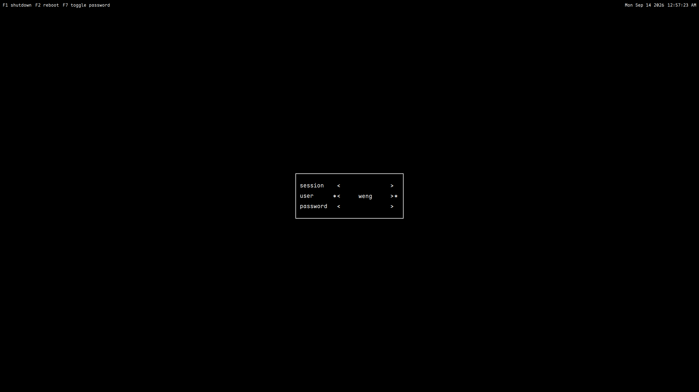
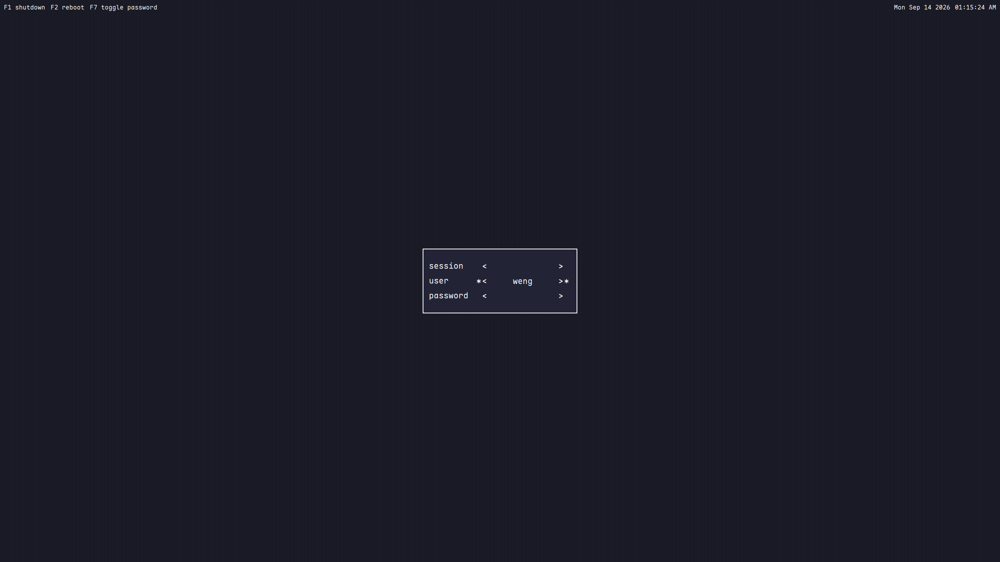

# simple-sddm

尝试还原 [ly](https://codeberg.org/fairyglade/ly) 的 SDDM 主题 — 终端 TUI 风格


| 界面预览 |
| :---: |
| | 
| |

## 安装

```bash
# 依赖，make(可选), for fedora
sudo dnf install -y make sddm qt6-qtdeclarative qt6-qtquickcontrols2 sddm-themes
sudo make install
```

## 手动
```bash
sudo cp -r . /usr/share/sddm/themes/simple-sddm
# 编辑 `/etc/sddm.conf`
sudo edit /etc/sddm.conf
```
```ini 
[Theme]
Current=simple-sddm
```

预览:
```bash
make test
```

## 配置
>可参考theme_example.conf

编辑 `/usr/share/sddm/themes/simple-sddm/theme.conf`

## 交互
```
- `↑/↓` 或 `Ctrl+K/J` / `Tab` 切换（session/login/password）
- `←/→` 或 `Ctrl+H/L` 在 session/login 选择
- `F1` 关机 (`sddm.powerOff`)、`F2` 重启、`F7` 明/密文切换
- `Enter` 登录
```

## 选择登录框显示在哪个输出
* 为空（默认）：所有屏都显示登录框
* 如 `eDP-1` / `HDMI-A-1` (大小写敏感)：只在该屏显示登录框，其他屏仅背景
```ini
primaryScreen=HDMI-A-1
```

## License

MIT
